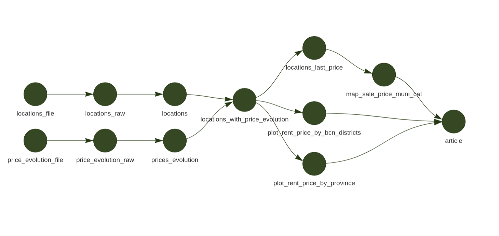

# Taller d'R Targets

## Resum

Aquest repositori és un projecte de mostra per a un taller d'R Targets.

Pretén ser una mostra de com organitzar un projecte en R utilitzant bones pràctiques i una estructura tipus `pipeline` amb el paquet Targets.

Utilitza dades aconseguides a partir d'un scraping de la web d'Idealista cortesia del [Sindicat de Llogateres](https://sindicatdellogateres.org/).

Abans de reproduir aquest projecte recomanem fer un cop d'ull a la [documentació oficial d'R Targets.](https://books.ropensci.org/targets/walkthrough.html)

## Estructura del projecte

Pel fet de seguir les bones pràctiques i els requeriments del paquet Targets el projecte segueix una estructura determinada.

### Directoris i fitxers:

-   `_targets.R`: És el fitxer índex del projecte targets. Conté la definició del pipeline.
-   `R/idealista_functions.R`: Conté les funcions, el codi específic per formar cada un dels nodes del pipeline.
-   `data/`: DIrectori que conté les dades inicials que es fan servir com a punt de partida del projecte.
-   `docs/`: Conté els documents de text. En aquest cas l'article que volem escriure.
-   `renv.lock`: Fitxer generat automàticament per Renv que conté la llista de paquests necessaris per executar el projecte. Aquest fitxer és el que llegeix la comanda `renv::restore()` Per crear l'entron d'R.
-   `.gitignore` Fitxer que utilitza GIT per saber quins fitxers ha d'ignorar, és a dir no pujar al repositori quan guardes el codi.

## Dades de partida

Partim d'uns CSV que són el resultat d'un scraping de la web d'Idealista que es poden trobar a la carpeta `data/`.

-   `data/20231229_idealista_locations_ppcc.csv` Conté totes les localitzacions (barri, districte, pobles, provínices) de les quals tenim dades i un conjunt de metadades associades.
-   `data/20231229_idealista_price_evolution_ppcc.csv` Conté l'històric de preus de lloguer i de venta de cada una de les localitzacions

## Pipeline



El projecte s'estructura al voltant d'una sèrie d'objectius que representen les tasques de processament i visualització de dades. Cada objectiu és un pas en el pipeline, responsable d'una peça específica de l'anàlisi.

-   **locations_file**, **locations_raw** i **locations**: Representen, respectaivament, el fitxer de partida, la importació del fitxer i la neteja de les dades (adequació a la forma que necessitem). El resultat del node **locations** és un *data frame* en què cada fila representa una localització.
-   **price_evolution_file**, **price_evolution_raw** i **price_evolution**: Representen, respectaivament, el fitxer de partida, la importació del fitxer i la neteja de les dades (adequació a la forma que necessitem). El resultat del node **price_evolution** és un *data frame* en què cada fila representa un mes concret per una localització amb el preu mitjà de lloguer i compra.
-   **locations_with_price_evolution:** És el join de **locations** i **price_evolution**. El resultat és un data frame en què cada fila és un lloc, un punt en el temps (un mes concret).
-   **location_last_price**: És un data frame derivat de **locations_with_price_evolution** que només té l'últim valor de lloguer i compra disponible en les dades. Així, cada localització només hi apreix amb representada amb una sola fila amb l'últim (més nou) valor de lloguer i compra. Ens serveix per poder fer un mapa.
-   **plot_rent_price_by...** Els dos nodes que tenen aquest prefix són gràfics d'evolució de preu fets amb `ggplot`.
-   **map_sale_price_muni_cat** Dibuixa un mapa a partir de les dades de **location_last_price.**
-   **article** És una mostra d'un Rmarkdown que recull els resulatts dels gràfics i mapa en forma d'article (text random de mostra generat artificialment).

### Mapa i plots


## Comencem

Per utilitzar aquest projecte, cloneu el repositori i assegureu-vos que teniu Renv instal·lat. Podeu executar el pipeline utilitzant les funcions del paquet `targets`, com ara `tar_make()` per executar tot el pipeline o `tar_visnetwork()` per visualitzar l'estructura del pipeline.

## Setup

Per configurar i començar a utilitzar aquest projecte, segueix els passos següents:

1.  **Assegura't que tens instal·lat prèviament l'Renv**:

    ``` r
    install.packages(’renv’)
    ```

2.  **Clonar el repositori:** Clona el repositori utilitzant Git amb la comanda següent:

    ``` bash
    git clone https://github.com/catbru/taller_targets.git
    ```

    Si no disposes de GIT pots descarregar el projecte com un ZIP fent clic a la pestanya verda code del repositori a la pàgina mateix de GitHub.

    <https://github.com/catbru/taller_targets>

3.  **Crear un projecte d'R Studio:** Utilitzant R Studio ves al directori que acabes de clonar i crea un nou projecte d'R Studio utilitzant l'opció 'using Renv'.

4.  **Activar renv:** En R Studio, obre la consola i activa l'entorn de renv amb:

    ``` r
    renv::activate()
    ```

5.  **Restaurar les dependències:** Encara en la consola, restaura les dependències del projecte amb:

    ``` r
    renv::restore()
    ```

6.  **Visualitzar la xarxa de dependències dels targets:** Per entendre millor com estan interconnectats els diferents components del projecte, pots visualitzar la xarxa de dependències dels targets amb:

    ``` r
    targets::tar_visnetwork(targets_only = TRUE)
    ```

    El paràmetre `targets_only = TRUE` fa que no presenti les funcions al gràfic, cosa que el fa molt més entenedor si el que volem és representar els diferents passos de transformació.

    Els nodes apareixen de color verd quan Targets té el resultat guardat. SI fem una modificació de la funció veurem que canvia el color fins que no fem `tar_make()`.

7.  **Executar el pipeline:** Finalment, per executar el pipeline complet del projecte, utilitza la següent comanda:

    ``` r
    targets::tar_make()
    ```

8.  **Visualitza l'article** resultant

    Un cop processats tots els passos del pipe l'últim és la generació d'un html a partir d'un Rmd que pots trobar a `docs/article.Rmd`. Com a resultat es crea un html a `docs/article.html` que pots obrir amb un navegador fent doble clic sobre l'arxiu o, si ho prefereixes, per obrir-lo des de l'R:

    ``` r
    rstudioapi::viewer('docs/article.html')
    ```

9.  **Visualitza el resultat** de qualsevol node en concret

    Podem veure el resultat o guardar-lo en una variable de qualsevol punt (node) del pipeline utilitzant la comanda `tar_read()`. Per exemple per aconseguir l'històric de preus de totes les localitzacions disponibles.

    ``` r
    prices <- targets::tar_read('locations_with_price_evolution')
    prices
    ```
